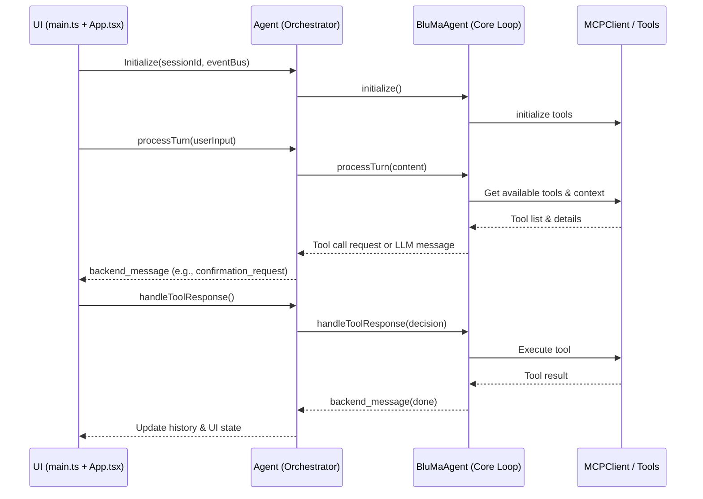
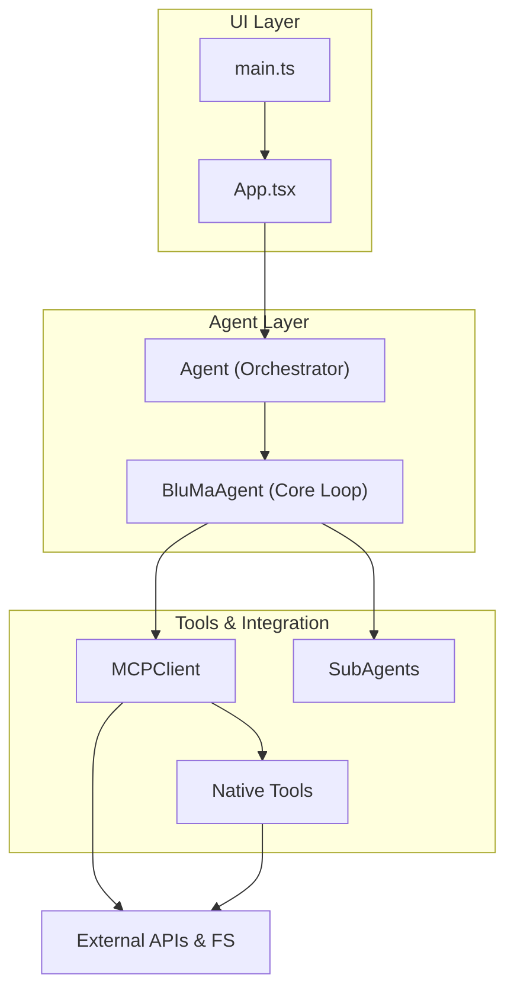
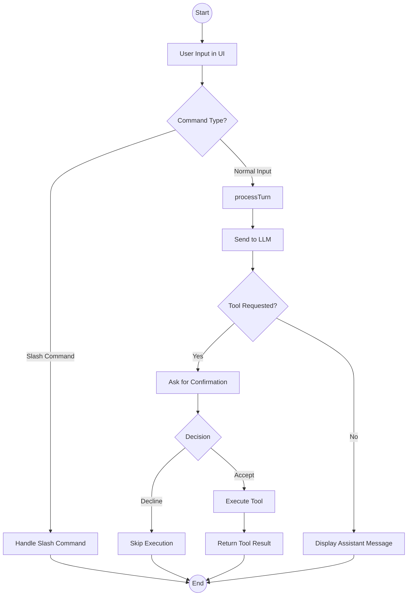
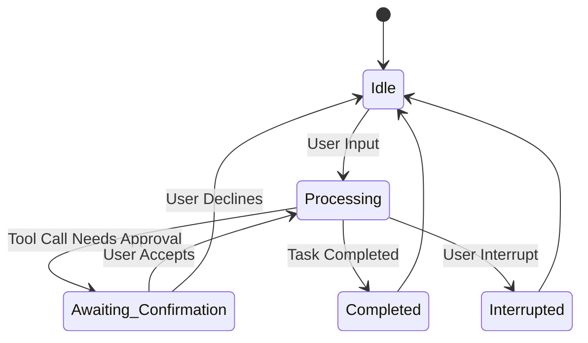
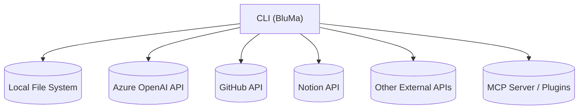
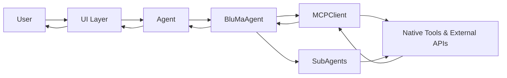

# BluMa CLI

[](https://www.npmjs.com/package/bluma)
[](LICENSE)
[](https://shields.io/)

<p align="center">
  
</p>

BluMa CLI is an independent agent for automation and advanced software engineering. The project is a conversational assistant that interacts via terminal (CLI), built with React/Ink, supporting smart agents (LLM, OpenAI Azure), tool execution, persistent history, session management, and extensibility through external plugins/tools.

---

## Table of Contents
- [Overview](#overview)
- [Key Features](#key-features)
- [Requirements](#requirements)
- [Architecture Diagram](#-architecture-diagram)
- [Installation](#installation)
- [Usage](#usage)
  - [Examples](#-usage-examples)
- [Configuration and Environment Variables](#configuration-and-environment-variables)
- [Development and Build](#development-and-build)
- [Extensibility: Tools and Plugins](#extensibility-tools-and-plugins)
- [Tests](#tests)
- [Limitations / Next Steps](#️-limitations--next-steps)
- [Security Notes](#-security-notes)
- [Tech Stack Overview](#stack)
- [Contributing](#-contributing)
- [License](#license)

---

## <a name="overview"></a>Overview
BluMa CLI is a modular conversational agent and task automation framework focused on advanced software engineering workflows. It runs entirely in the terminal using React (via Ink) for a rich interactive UI, and is architected around a **UI layer** (`main.ts` + `App.tsx`) and an **agent layer** (`Agent` orchestrator + `BluMaAgent` core). It enables LLM-powered automation, documentation, refactoring, running complex development tasks, and integrating with both native and external tools. The system features persistent sessions, contextual reasoning, smart feedback, and an interactive confirmation system for controlled execution.

---

## <a name="key-features"></a>Key Features
- **Rich CLI interface** using React/Ink 5, with interactive prompts and custom components.
- **Session management:** automatic persistence of conversation and tool history via files.
- **Central agent (LLM):** orchestrated by Azure OpenAI (or compatible), enabling natural language-driven automation.
- **Tool invocation:** native and via MCP SDK for running commands, code manipulation, file management, and more.
- **Dynamic prompts:** builds live conversational context, behavioral rules, and technical history.
- **Smart feedback component** with technical suggestions and checks.
- **ConfirmPrompt & Workflow Decision:** confirmations for sensitive operations, edit/code previews, always-accepted tool whitelists.
- **Extensible:** easily add new tools or integrate external SDK/plugins.

---

## <a name="requirements"></a>Requirements
- Node.js >= 18
- npm >= 9
- Account (with key) for Azure OpenAI (or equivalent variables for OpenAI-compatible endpoints)

---

## <a name="installation"></a>Installation

### Recommended: Global Installation

> **Important:** It is recommended to install BluMa globally so the `bluma` command works in any terminal.

```bash
npm install -g @nomad-e/bluma-cli
```

If you get permission errors, EXAMPLES:
  - **Linux:** Run as administrator using `sudo`:
    ```bash
    sudo npm install -g @nomad-e/bluma-cli
    ```
  - **Windows:** Open Command Prompt/Terminal as Administrator and repeat the command

> **macOS:** After global installation, **always run the `bluma` command without sudo**:
>
> ```bash
> bluma
> ```
> Running with sudo may cause permission problems, environment variable issues, and npm cache ownership problems.
> Only use sudo to install, never to run the CLI.

### Setting Up Environment Variables
For BluMa CLI to operate with OpenAI/Azure, GitHub, and Notion, set the following environment variables globally in your system.

**Required:**
- `AZURE_OPENAI_ENDPOINT`
- `AZURE_OPENAI_API_KEY`
- `AZURE_OPENAI_API_VERSION`
- `AZURE_OPENAI_DEPLOYMENT`
- `GITHUB_PERSONAL_ACCESS_TOKEN` (if you'll use GitHub)
- `NOTION_API_TOKEN` (if you'll use Notion)

#### How to set environment variables globally:

**Linux/macOS:**
Add to your `~/.bashrc`, `~/.zshrc`, or equivalent:
```sh
export AZURE_OPENAI_ENDPOINT="https://..."
export AZURE_OPENAI_API_KEY="your_key"
export AZURE_OPENAI_API_VERSION="2024-06-01"
export AZURE_OPENAI_DEPLOYMENT="bluma-gpt"
export GITHUB_PERSONAL_ACCESS_TOKEN="..."
export NOTION_API_TOKEN="..."
```
Then run:
```sh
source ~/.bashrc # or whichever file you edited
```

**Windows (CMD):**
```cmd
setx AZURE_OPENAI_ENDPOINT "https://..."
setx AZURE_OPENAI_API_KEY "your_key"
setx AZURE_OPENAI_API_VERSION "2024-06-01"
setx AZURE_OPENAI_DEPLOYMENT "bluma-gpt"
setx GITHUB_PERSONAL_ACCESS_TOKEN "..."
setx NOTION_API_TOKEN "..."
```
(Only needs to be run once per variable. Restart the terminal after.)

**Windows (PowerShell):**
```powershell
[Environment]::SetEnvironmentVariable("AZURE_OPENAI_ENDPOINT", "https://...", "Machine")
[Environment]::SetEnvironmentVariable("AZURE_OPENAI_API_KEY", "your_key", "Machine")
[Environment]::SetEnvironmentVariable("AZURE_OPENAI_API_VERSION", "2024-06-01", "Machine")
[Environment]::SetEnvironmentVariable("AZURE_OPENAI_DEPLOYMENT", "bluma-gpt", "Machine")
[Environment]::SetEnvironmentVariable("GITHUB_PERSONAL_ACCESS_TOKEN", "...", "Machine")
[Environment]::SetEnvironmentVariable("NOTION_API_TOKEN", "...", "Machine")
```

### ℹ️ Global Installation of npm Packages in PowerShell (Windows)
When installing BluMa (or any npm package globally) in PowerShell, you might see:
```
Do you want to change the execution policy?
[Y] Yes  [A] Yes to All  [N] No  [L] No to All  [S] Suspend  [?] Help (default is "N"):
```
👉 **Choose `Y` (Yes) or `A` (Yes to All)**. This will change the execution policy to **RemoteSigned** (only scripts from the internet need a digital signature).

- This is safe for devs: Windows only requires digital signatures for web scripts—local scripts, from npm, work normally.
- Read more: [About Execution Policies (Microsoft Docs)](https://learn.microsoft.com/en-us/powershell/module/microsoft.powershell.security/about/about_execution_policies)

**To restore the default policy after installation, run:**
```powershell
Set-ExecutionPolicy Default
```

> **Tip:** Restart your terminal to ensure the variables are loaded globally.

---

## <a name="how-to-run"></a>How to Run
```bash
npm start
# Or directly using the built binary
npx bluma
```
==> The CLI will open an interactive terminal interface for dialogue, command execution, and engineering workflow automation.

---

## <a name="project-structure"></a>Project Structure
```
bluma-engineer/
├── package.json               # npm/project config
├── tsconfig.json              # TypeScript config
├── scripts/build.js           # Build script using esbuild
├── src/
│   ├── main.ts                # Entry point (Ink renderer)
│   └── app/
│        ├── agent/            # Agent core (session mgmt, tools, MCP, prompt, feedback)
│        ├── ui/               # Ink/React CLI interface components
│        └── protocols/        # Protocols & helpers
```
---

## <a name="development-and-build"></a>Development and Build
- Build is performed using [esbuild](https://esbuild.github.io/) (see scripts/build.js).
- TS source files are in `src/` and compiled to `dist/`.
- Use `npm run build` to compile and get the CLI binary ready.
- Config files are automatically copied to `dist/config`.

### Main scripts:
```bash
npm run build    # Compiles project to dist/
npm start        # Runs CLI (after build)
npm run dev      # (If configured, hot-reload/TS watch)
```

---

## <a name="extensibility-tools-and-plugins"></a>Extensibility: Tools and Plugins
- Add native tools in `src/app/agent/tools/natives/`
- Use the MCP SDK for advanced plugins integrating with external APIs
- Create custom Ink components to expand the interface

---

## <a name="tests"></a>Tests
- The repository ships with Jest 30 configured (babel-jest) and TypeScript support.
- Test files are located under `tests/` and follow `*.spec.ts` naming.
- Run tests:

```bash
npm test
npm run test:watch
```

---

## Live Dev Overlays (Open Channel During Processing)
BluMa supports a live side-channel that stays active even while the agent is processing. This lets the dev send guidance or constraints in real-time — like pair programming.

Key points
- Permissive mode enabled: during processing, any free text you type is treated as a [hint] automatically.
- Structured prefixes are also supported at any time:
  - [hint] Text for immediate guidance to the agent
  - [constraint] Rules/limits (e.g., "não tocar em src/app/agent/**")
  - [override] Parameter overrides as key=value pairs (e.g., "file_path=C:/... expected_replacements=2")
  - [assume] Register explicit assumptions
  - [cancel] Interrupt safely (already supported)

How it works
- Frontend: the input remains active in read-only (processing) mode and emits a dev_overlay event.
- Agent backend: consumes overlays with precedence (constraint > override > hint). Hints and assumptions are injected into the system context before the next decision; overrides/constraints adjust tool parameters just before execution.
- Logging & history: every overlay is logged and stored in session history for auditability.

Examples
- During a long task, just type:
  - "Prefer do not touch tests yet" → will be treated as [hint]
  - "[constraint] não editar src/app/ui/**" → blocks edits under that path
  - "[override] expected_replacements=2" → adjusts the next edit_tool call
  - "[assume] target=api" → adds an assumption in context

Notes
- The side-channel does not pause the agent — it adapts on the fly.
- If an overlay conflicts with the current plan: constraint > override > hint.
- All overlays are acknowledged via standard internal messages and persisted.

---

## <a name="configuration-and-environment-variables"></a>Configuration and Environment Variables
You must create a `.env` file (copy if needed from `.env.example`) with the following variables:
- `AZURE_OPENAI_ENDPOINT`
- `AZURE_OPENAI_API_KEY`
- `AZURE_OPENAI_API_VERSION`
- `AZURE_OPENAI_DEPLOYMENT`
- `GITHUB_PERSONAL_ACCESS_TOKEN` (optional; required for GitHub integrations)
- `NOTION_API_TOKEN` (optional; required for Notion integrations)

And others required by your agent/context or Azure setup.

Advanced config files are located in `src/app/agent/config/`.

---

## <a name="stack"></a>Tech Stack Overview
- Language: TypeScript (ESM)
- Runtime: Node.js >= 18
- CLI UI: React 18 via Ink 5, plus `ink-text-input`, `ink-spinner`, `ink-big-text`
- Bundler: esbuild, with `esbuild-plugin-node-externals`
- Test Runner: Jest 30 + babel-jest
- Transpilers: Babel presets (env, react, typescript)
- LLM/Agent: Azure OpenAI via `openai` SDK; MCP via `@modelcontextprotocol/sdk`
- Config loading: dotenv
- Utilities: uuid, diff, react-devtools-core

---

## <a name="license"></a>License
Apache-2.0. Made by Alex Fonseca and NomadEngenuity contributors.

Enjoy, hack, and—if possible—contribute!

---

## 🏗 Architecture Diagram
Below is a simplified diagram showing BluMa CLI's core architecture:
```
[ main.ts ] → [ App.tsx (UI Layer) ]
       ↓
[ Agent (Orchestrator) ]
       ↓
[ BluMaAgent (Core Loop & State) ]
       ↓
[ MCPClient / Tools / Native Tools / SubAgents ]
       ↓
[ External APIs & System Operations ]
```
This flow ensures a clean separation between presentation, orchestration, core logic, and integration layers.

### Sequence Diagram


---

### Component Diagram


---

### Activity Diagram


---

### State Machine Diagram


---

### Deployment Diagram


---

### Data Flow Diagram


---

## 💡 Usage Examples
- **Run Initialization Command**
```
/init
```
Executes the `init` subagent to prepare the working environment.

- **Confirm an Edit Operation**
When the system prompts an `edit_tool` operation, review the preview and choose:
```
Accept | Decline | Accept Always
```

- **Live Overlay**
During a long-running task, you can send hints:
```
[hint] Prefer small batch edits
[constraint] Avoid editing src/app/ui/**
```

---

## 🤝 Contributing
We welcome contributions! For full details, read [CONTRIBUTING.md](CONTRIBUTING.md).

### 📋 Prerequisites
- **Node.js** >= 18 and **npm** >= 9 installed
- Dependencies installed via `npm install`
- Required environment variables configured (see *Configuration* section)

### 🔄 Contribution Workflow
1. **Fork** the repository
2. **Clone** your fork locally
3. Create a feature branch named according to [Conventional Commits](https://www.conventionalcommits.org/) (e.g., `feat/add-logging`)
4. Commit changes with meaningful messages
5. Push to your fork and open a Pull Request

### 🛠 Code Standards
- Follow TypeScript strict mode guidelines
- Maintain style via ESLint and Prettier (`npm run lint`)
- Keep functions short, modular, and documented with JSDoc
- All business logic must have unit tests

### 🧪 Testing Requirements
- Run `npm test` and ensure all tests pass
- Include new tests for any new functionality or bug fix
- Validate integration tests when adding new tools or APIs

### 🔍 Code Review Process
- Minimum of 1 maintainer approval before merge
- Resolve all review comments and passing CI before merge

### 📄 Documentation
- Update README.md or relevant Wiki pages when adding/removing features
- Add or update CHANGELOG.md for notable changes

---

## ⚠️ Limitations / Next Steps
- Current LLM integration optimised for Azure OpenAI; add more providers.
- Logging verbosity could be made configurable.
- Potential for richer plugin lifecycle (install/remove at runtime).
- Improve error reporting in subagents.

---

## 🔒 Security Notes

---

## 🛠 Error Handling & Recovery Flows
BluMa handles different classes of errors gracefully:
- **Network/API Errors**: Retry logic with exponential backoff.
- **Authentication Failures**: Immediate notification to user, requires updating environment variables.
- **Tool Execution Errors**: Displayed with detailed message; execution can be retried or skipped.
- **LLM/API Exceptions**: Fall back to safe mode and keep context intact.
- **Session/History Save Failures**: Warn user and continue without losing core functionality.

---

## 📈 Metrics & Observability
- **Performance Metrics**: Average response time, tokens used per request, tool execution times.
- **Usage Tracking**: Number of commands executed, tool calls, sessions created.
- **Logging**: Structured logs for all events.
- Integration-ready with Prometheus/Grafana or external observability platforms.

---

## 🔐 Advanced Security Practices
- Use secret management tools (Vault, AWS Secrets Manager) to store environment variables.
- Apply principle of least privilege for API keys.
- Validate and sanitize all user inputs to avoid prompt injection attacks.
- Regularly rotate API keys.

---

## 🚀 Performance & Scalability
- Optimize context window by pruning irrelevant history.
- Batch related operations to reduce LLM calls.
- Support for distributed execution or remote agent hosting.
- Cache static responses where possible.

---

## 🔄 Development Cycle & CI/CD
- **Testing**: `npm test` and `npm run test:watch` for development.
- **Linting**: Enforce coding standards with ESLint/Prettier.
- **CI/CD**: Recommended GitHub Actions or similar to run tests/build on push.
- **Deployment**: Automatic packaging to npm or internal registry.

---

## 🗺 Roadmap & Release Notes
**Upcoming:**
- Multi-LLM provider support.
- Web-based dashboard.
- Richer subagent plugin APIs.

**Release Notes**:
- Follow [CHANGELOG.md](CHANGELOG.md) for version history.

---

## 🎯 Advanced Use Cases
- Chain multiple tools with complex decision-making.
- Build custom subagents for domain-specific automation.
- Integrate with CI pipelines for automated code review and refactoring.

---

## 📏 Code Standards & Contribution Guidelines
- Follow TypeScript strict mode.
- Commit messages must follow Conventional Commits (`feat:`, `fix:`, `chore:`).
- Keep functions short, modular and documented.
- Add unit tests for all business logic.

---
- Protect your API keys: never commit `.env` files.
- `edit_tool` can modify files — review previews before accepting.
- Use restricted permissions for API tokens wherever possible.
- If using on shared systems, ensure `.bluma-cli` config is private.
